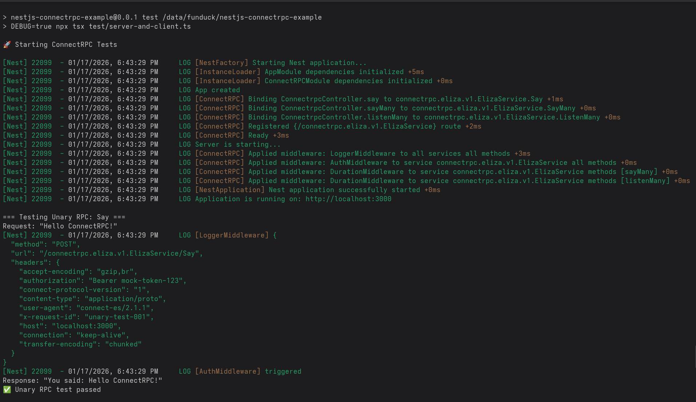
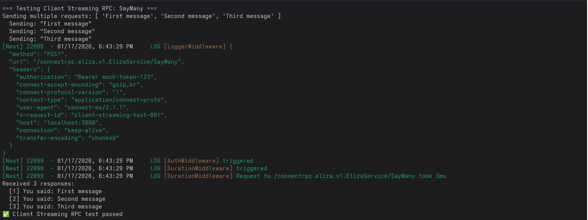
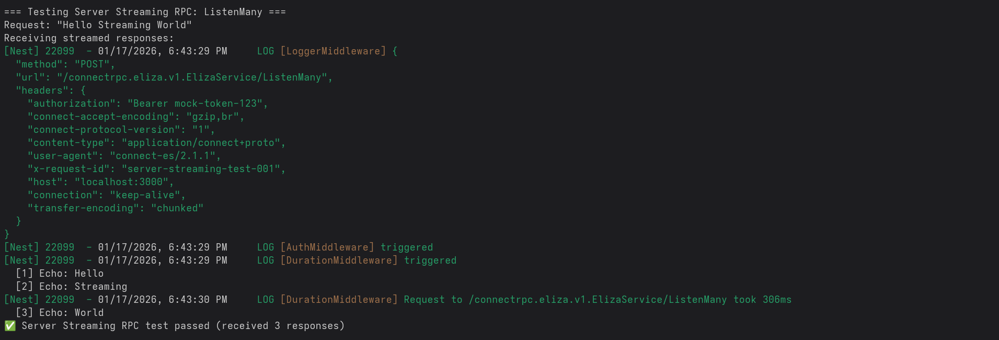

<p align="center">
  <a href="https://connectrpc.com"></a>
  <a href="http://nestjs.com/" target="blank"></a>
</p>

## Description

This is an example of production integration of [ConnectRPC](https://github.com/connectrpc/connect-es) for Nodejs into 
[Nest](https://github.com/nestjs/nest) framework.

### Features
This example shows:
* rpc with simple request and response messages
* rpc with stream in response
* rpc with stream in request

*RPC with bidirectional stream is out of current scope because it requires HTTP/2 which is unstable in public networks. Practice shows much better and (most important) consistent performance over HTTP/1.*

## Prerequisites
* Nodejs
* Nest + Fastify server

## Project setup

```bash
$ pnpm install
```

To compile proto files if you change them
```bash
$ pnpm run compile-proto
```

## Compile and run the test

```bash
$ pnpm run test
```

## Test output


