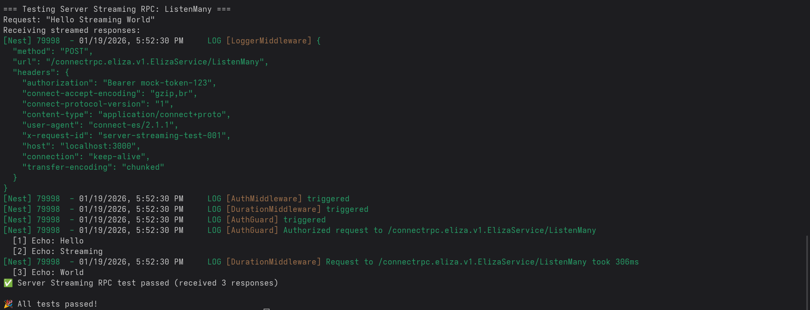

<p align="center">
  <a href="https://connectrpc.com"></a>
  <a href="http://nestjs.com/" target="blank"></a>
</p>

## Description

This is an example of production integration of [ConnectRPC](https://github.com/connectrpc/connect-es) for Nodejs into 
[Nest](https://github.com/nestjs/nest) framework.

### Basic example
Configure `ConnectRPCModule` in some of your modules, usually `app.module.ts` is used for such things:
```TS
@Module({
  imports: [
    ConnectRPCModule.forRoot({
        logger: new Logger('ConnectRPC', { timestamp: true }),
    }),
  ]
})
export class AppModule {}
```

At least one controller should implement service described in proto
```TS
export class ConnectrpcController implements Service<typeof ElizaService> {
  constructor() {
    ConnectRPC.registerController(this, ElizaService);
  }

  async say(
    request: SayRequest,
  ) {
    return {
      sentence: `You said: ${request.sentence}`,
    };
  }

```

And during bootstrap register plugin **after** `app` is created and **before** it is initialized
```TS
  const app = await NestFactory.create<NestFastifyApplication>(
    AppModule,
    new FastifyAdapter(),
  );

  await app.get(ConnectRPCModule).registerPlugin();

  await app.listen(80);
```

For more details start reading from `src/app.module.ts`

### Features
This example shows:
* rpc with simple request and response messages
* rpc with stream in response
* rpc with stream in request
* how to use middlewares
* how to use global guards

*RPC with bidirectional stream is out of current scope because it requires HTTP/2 which is unstable in public networks. Practice demostrates more consistent performance over HTTP/1.*

## Prerequisites
* Nodejs
* Nest + Fastify server

## Project setup

```bash
$ pnpm install
```

To compile proto files if you change them
```bash
$ pnpm run compile-proto
```

## Compile and run the test

```bash
$ pnpm run test
```

## Test output




## Feedback
Please use [Discussions](https://github.com/funduck/nestjs-connectrpc-fastify/discussions) or email me.